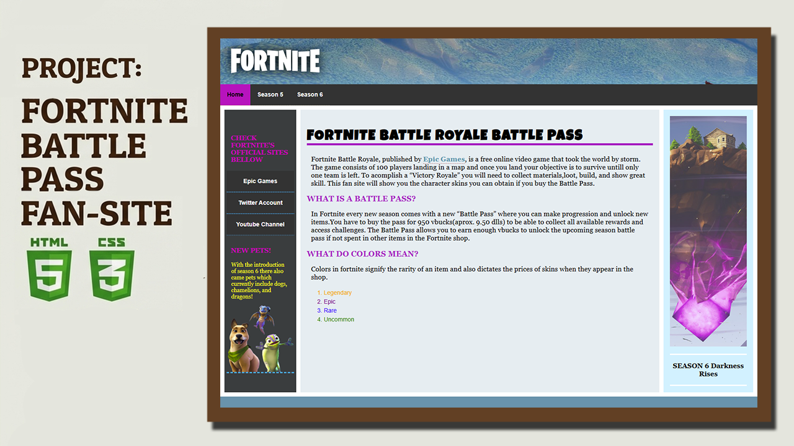

  

<h1 align="center">Hi 👋, I'm Ricardo Valdez</h1>
<h3 align="center"></h3>

<h4 align="center">
Computer Science graduate.
</h4>

<!-- SKILLS -->
<!-- ------------------ -->
 

<h2 align="center">Skills</h2>

&nbsp;&nbsp;&nbsp;&nbsp;&nbsp;&nbsp;&nbsp;&nbsp;

 

<!-- PROJECTS -->

<h2 align="center">Projects</h2>

  
...

  

 

<!-- CONTACT -->

<h2 align="center">Contact</h2>

  &nbsp;

<!-- STATS -->

<h2 align="center">Stats</h2>

<!--

  

  

-->

  

  

